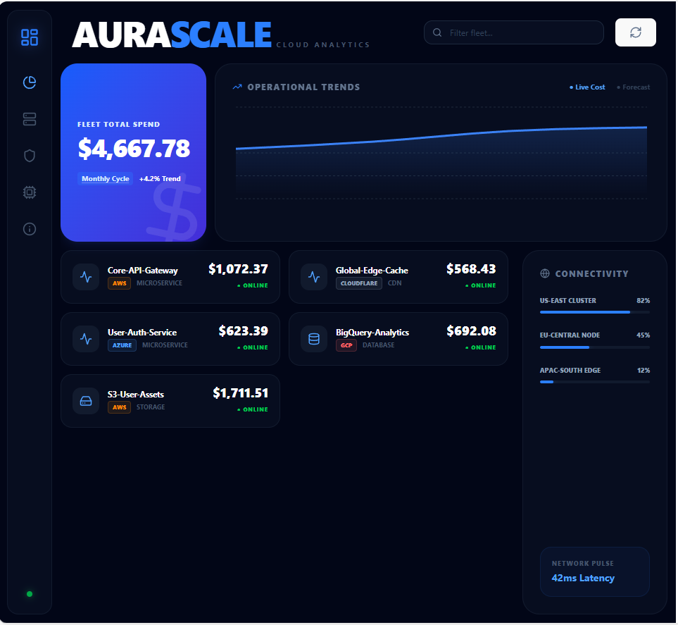

# 🌌 AuraScale Systems | Unified Cloud Intelligence

> **The Hook:** A "Single Pane of Glass" that seamlessly connects Cloud Infrastructure Costs, Security Vulnerabilities, and Deployment Health into a high-performance command center.
## 🚀 The Vision
Managing fragmented cloud infrastructure is the #1 cause of budget overruns and security blind spots. **AuraScale Systems** solves this by centralizing data from AWS, Azure, GCP, and Cloudflare into a unified, viewport-locked dashboard. No scrolling. No noise. Just the signals you need to scale safely.


## 💎 Core Pillars

### 1. Cost Intelligence (FinOps)
* **Fleet-Wide Aggregation:** Real-time cost tracking across multiple providers.
* **Historical Trends:** Built-in predictive analytics visualizing spend cycles over time.
* **Granular Visibility:** Drill down into specific microservices, databases, or storage buckets.

### 2. Deployment Health (DevOps)
* **Real-time Status Monitoring:** Live heartbeats for all infrastructure nodes.
* **Multi-Cloud Integration:** Native support for AWS EC2/S3, Azure Services, and GCP BigQuery.
* **Latency Tracking:** Regional pulse monitoring to ensure global deployment health.

### 3. Security & Connectivity (SecOps)
* **Regional Distribution:** Visual heatmaps of system load and regional placement.
* **Encrypted Data Layer:** Leveraging Prisma 7's modern driver adapters for secure database communication.
* **Zero-Scroll UI:** A glassmorphic "Command Center" designed for high-density information display.
---
## 🛠️ The Tech Stack
| Layer | Technology | Key Advantage |
| :--- | :--- | :--- |
| **Frontend** | React + Vite | Blazing fast HMR and sub-second load times. |
| **Styling** | Tailwind CSS 4 | CSS-first architecture for the modern "Glass" UI. |
| **ORM** | Prisma 7 | Type-safe queries with advanced PostgreSQL driver support. |
| **Backend** | Node.js 22 | Modern ESM environment for high-throughput API gateway. |
| **Visuals** | Recharts | Low-latency SVG-based data visualization. |
---
## 🏗️ Technical Architecture
AuraScale utilizes a modern monorepo structure:
- **`apps/api`**: Express.js server providing a standardized API for multi-cloud data.
- **`apps/frontend`**: Viewport-locked React application optimized for 1080p and 4K command centers.

---

## ⚡ Quick Start

### 1. Prerequisites
* Node.js v22+
* PostgreSQL Database

### 2. Installation
```bash
# Clone the repository
git clone [https://github.com/nahorfelix/Aurascale-cloud-intelligence-monorepo-structure-.git](https://github.com/nahorfelix/Aurascale-cloud-intelligence-monorepo-structure-.git)

# Install dependencies
npm install